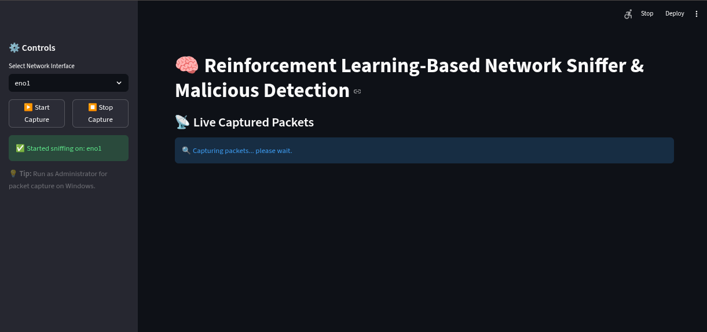
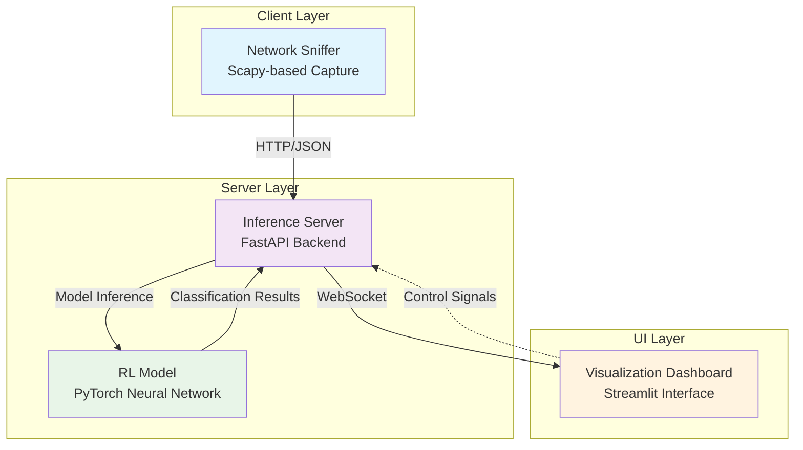

# 🤖 Packet Sniffer RL: Reinforcement Learning-Based Network Intrusion Detection System

## Executive Summary

The Packet Sniffer RL project presents an innovative approach to network security monitoring by combining traditional packet capture techniques with reinforcement learning methodologies. This system addresses the critical challenge of real-time malicious activity detection in network traffic, offering a more adaptive and intelligent alternative to conventional signature-based intrusion detection systems.

Our solution transforms raw network packets into behavioral event sequences, which are then processed by a trained neural network to predict the likelihood of malicious activity. This approach enables the system to detect previously unseen attack patterns and adapt to evolving threat landscapes.



## Technical Architecture

The system implements a distributed architecture with three primary components:



- **Network Sniffer (Client)**: Captures live network traffic using Scapy, preprocesses packets into behavioral events, and forwards them to the inference server
- **Inference Server (FastAPI)**: Processes incoming events through the trained RL model, maintains session state with sliding window feature extraction, and provides real-time classification
- **Visualization Dashboard (Streamlit)**: Provides real-time monitoring, visualization of captured packets, and model predictions with intuitive UI controls

## Implementation Details

### Reinforcement Learning Methodology

The system employs a policy-gradient reinforcement learning approach where:

- **State Space**: A sliding window of the last 10 network events, represented as concatenated one-hot encoded vectors
- **Action Space**: Binary classification (0: Benign, 1: Malicious)
- **Reward Function**: +1 for correct classification, -1 for incorrect classification
- **Policy Network**: A feedforward neural network with two hidden layers (128 and 64 neurons) with ReLU activations followed by a softmax output layer

### Feature Engineering

Network packets are transformed into behavioral events using the following mapping:
- TCP SYN flags → "open_socket" event
- TCP FIN flags → "close_socket" event  
- Raw payload presence → "read_file" event (approximation)

The sliding window mechanism maintains the last 10 events as a fixed-length feature vector of size 80 (10 events × 8 event types), enabling the model to recognize temporal patterns in network behavior.

### Model Training

The reinforcement learning agent is trained on synthetic behavioral traces containing both benign and malicious patterns. Training involves:
- Episode-based learning with trajectory sampling from behavioral traces
- Policy gradient updates using REINFORCE algorithm
- Continuous evaluation and model checkpointing

## Results and Performance

Current model performance metrics:
- **Overall Accuracy**: 63.17%
- **Malicious Activity Detection**: 100.00% (no false negatives)
- **Benign Activity Classification**: 33.90% (high false positive rate)

While the model demonstrates excellent capability in identifying malicious activities (critical for security applications), there's room for improvement in reducing false positives for benign traffic. This trade-off reflects the security-first design principle prioritizing threat detection over precision in normal traffic classification.

## Deployment and Usage

### Prerequisites
- Python 3.8+
- PyTorch
- FastAPI
- Streamlit
- Scapy
- uvicorn

### Installation
```bash
pip install torch gymnasium scapy streamlit fastapi uvicorn requests numpy pandas
```

### Manual Component Startup

For more control over individual components, you can start them separately.

<details>
<summary>Linux Instructions</summary>

> [!WARNING]
> The packet sniffer requires root privileges to access network interfaces in real-time.

1. **Start the Inference Server**:
   ```bash
   python -m uvicorn server.inference_server:app --host 0.0.0.0 --port 8000
   ```

2. **Run the Packet Sniffer** (in another terminal with sudo):
   ```bash
   sudo python client/sniffer_forwarder.py --iface [interface_name]
   ```

3. **Launch the Dashboard** (in another terminal):
   ```bash
   streamlit run ui/dashboard.py
   ```

</details>

<details>
<summary>Windows Instructions</summary>

> [!WARNING]
> The packet sniffer requires administrator privileges to access network interfaces in real-time.

1. **Start the Inference Server**:
   ```cmd
   python -m uvicorn server.inference_server:app --host 0.0.0.0 --port 8000
   ```

2. **Run the Packet Sniffer** (in another command prompt as Administrator):
   ```cmd
   python client/sniffer_forwarder.py --iface [interface_name]
   ```

3. **Launch the Dashboard** (in another command prompt):
   ```cmd
   streamlit run ui/dashboard.py
   ```

</details>

### Alternative: Integrated Dashboard (Mock RL Model)

For a simplified setup without the full server infrastructure, use the integrated solution with a simulated RL model:
```bash
streamlit run integrated_sniffer_rl_dashboard.py
```

> [!NOTE]
> The integrated dashboard uses a mock RL model for demonstration purposes and does not connect to the actual trained model.

### Complete System with main.py (Recommended)

For the complete system with actual RL model inference, use the main.py script:

<details>
<summary>Linux Instructions</summary>

> [!WARNING]
> The project requires root privileges to access network interfaces in real-time. The main.py script handles this automatically.

1. **Run the complete system**:
   ```bash
   sudo python main.py --interface [interface_name]
   ```

   This will start:
   - Inference server on port 2000
   - Dashboard on port 8501
   - Packet sniffer on the specified interface

</details>

<details>
<summary>Windows Instructions</summary>

> [!WARNING]
> The project requires administrator privileges to access network interfaces in real-time. Run as Administrator.

1. **Run the complete system** (as Administrator):
   ```cmd
   python main.py --interface [interface_name]
   ```

   This will start:
   - Inference server on port 2000
   - Dashboard on port 8501
   - Packet sniffer on the specified interface

</details>

## Future Enhancements

### Technical Improvements
- **Model Optimization**: Implement attention mechanisms for better interpretability and improved accuracy balance
- **Feature Expansion**: Incorporate additional network protocol features (ports, protocols, timing patterns)
- **Federated Learning**: Enable collaborative threat intelligence without sharing sensitive network data
- **Encrypted Traffic Analysis**: Develop behavioral pattern recognition for encrypted communications

### Architectural Enhancements
- **Scalability**: Implement distributed processing for high-throughput network environments
- **Real-time Adaptation**: Enable online learning capabilities for continuous model updates
- **Threat Intelligence Integration**: Connect with external threat feeds for contextual awareness

### Advanced Analytics
- **Anomaly Scoring**: Implement confidence intervals and uncertainty quantification
- **Attack Attribution**: Enhance classification with attack type identification
- **Risk Assessment**: Integrate business context for risk-based alerting

## Academic and Industry Relevance

### Research Contributions
This project contributes to the growing field of AI-driven cybersecurity by demonstrating:
- Practical application of reinforcement learning in network security
- Behavioral analysis techniques for intrusion detection
- Real-time processing challenges in security analytics

### Industry Applications
The system addresses critical needs in:
- **Enterprise Security Operations Centers (SOCs)**: Automated threat detection reducing analyst workload
- **Cloud Security**: Scalable monitoring for cloud infrastructure
- **IoT Security**: Lightweight detection for resource-constrained devices
- **Compliance Monitoring**: Continuous network behavior analysis for regulatory compliance

### Technical Skills Demonstrated
- Deep learning model development and deployment
- Distributed system architecture design
- Real-time data processing and streaming
- Network protocol analysis and packet capture
- Full-stack development (Python backend, interactive UI)
- MLOps practices (model versioning, evaluation, deployment)

This project represents a sophisticated integration of multiple cutting-edge technologies to address a critical cybersecurity challenge, demonstrating both theoretical understanding and practical implementation capabilities in AI-driven security solutions.